<div align="center">
  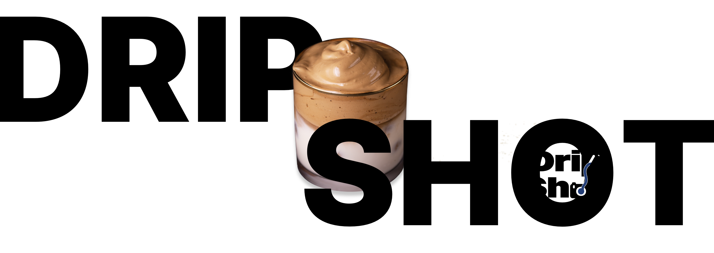
</div>


# ☕ DripShot
> <div align="center">
>   
> </div>
>
> **"Find the perfect cafe that complements your OOTD (Outfit Of The Day)."**

DripShot is a **cafe recommendation service** that takes a **picture of your outfit** to give you cafe recommendations based on the aesthetic of the outfit! Developed as part of the YBIGTA 25th New-Member Project. 

Please refer to these slides to find out about the creation process and the components of this 
[project](https://drive.google.com/file/d/1Wukl8RSSAWe9i8TCER0tJx4dkLYRmkU_/view?usp=drive_link) (Korean)

## Table of Contents
- [☕ DripShot](#-dripshot)
  - [Table of Contents](#table-of-contents)
  - [📍 Service Concept](#-service-concept)
  - [📍 Tech Stack](#-tech-stack)
  - [📍 Project Flow](#-project-flow)
  - [📍 Service Pipeline \& Features](#-service-pipeline--features)
    - [Pipeline](#pipeline)
    - [Features](#features)
  - [📍 CNN Model](#-cnn-model)
    - [Style Classification](#style-classification)
  - [📍 Similarity Analysis](#-similarity-analysis)
    - [Model Selection](#model-selection)
  - [📍 Improvements](#-improvements)
  - [📍 Team DripShot (YBIGTA 25th)](#-team-dripshot-ybigta-25th)
  - [📍 Version History](#-version-history)
  - [📍 Acknowledgments](#-acknowledgments)

## 📍 Service Concept
* **Problem Definition**: Existing cafe recommendation services rely heavily on location or general popularity, making it difficult for users to find cafes that match their specific "look" or mood for the day.
* **Solution**: DripShot analyzes the user's outfit using Computer Vision and matches it to cafes based on aesthetics to provide a personalized curation of "Instagrammable" spots.
* **Target Area**: The service currently focuses on Seongsu-dong, a trend-sensitive hub with a high density of unique cafes. 

## 📍 Tech Stack
* **Language**:  
* **Frontend**:   
* **Backend**: 
* **AI/ML**:  
* **Database**: 
* **Deployment**: 

## 📍 Project Flow
<div align="center">
  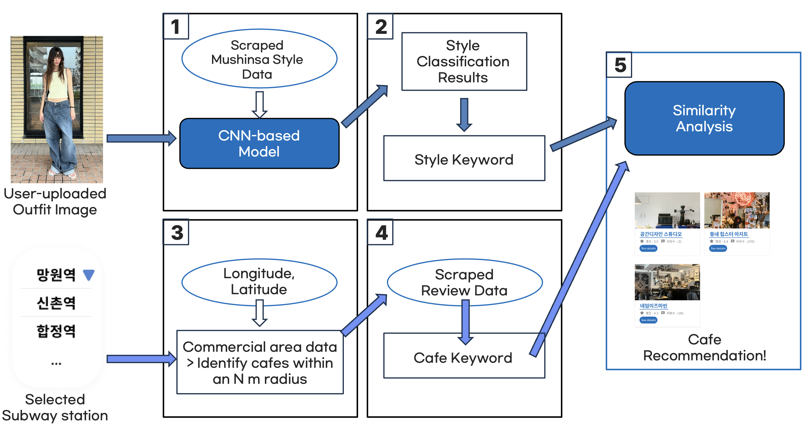
</div>
<div align="center">
  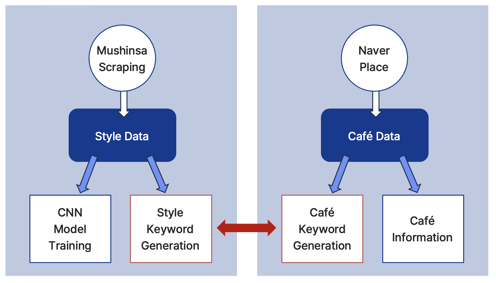
</div>

1. **Data Scraping**
   * **Fashion Data**: Scraped style images and tags from Musinsa Snap (646,467+ snaps, labeled).
   * **Cafe Data**: Collected cafe info, visitor reviews, and images from Naver Place. 
2. **Style Classification**
   * **CNN-based Model**: Used labeled fashion data for style classification
3. **Keyword Generation**
   * **Style Keyword**: Defined core keywords for 12 distinct fashion styles (e.g., Casual -> Daily, Casual Chats, Easy Access).
   * **Cafe Keyword**: Summarized scraped Naver reviews and extracted environmental keywords with frequency-based weights, using GPT-4o-mini.
4. **Similarity Analysis**
   * Compares style and cafe keyword vectors using **CountVectorizer** to match fashion styles and cafes. 

## 📍 Service Pipeline & Features
### Pipeline
<div align="center">
  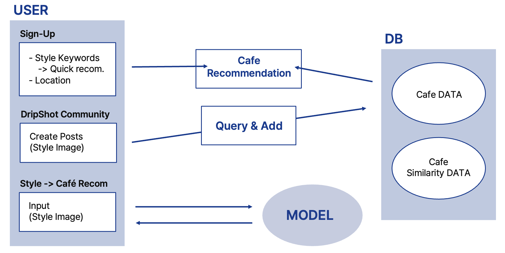
</div>

### Features
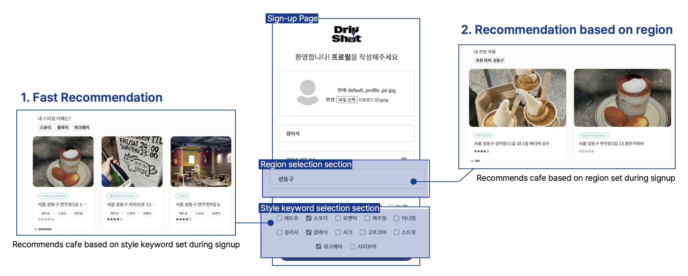
1. **Fast Recommendation** : Users can select their preferred style during sign-up. Before a photo is uploaded, the service provides instant cafe recommendations based on these selected styles.
2. **Region-based Recommendation** : Users can select their preferred region during signup. Recommendations are made based on nearby cafes. 

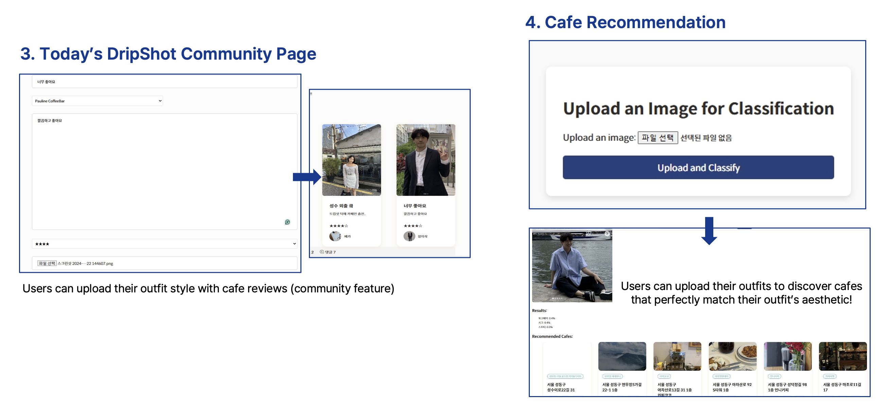

3. **Today's DripShot Community Page** : After taking a photo of their outfit, users can upload their pictures at the community page. Users can also rate the recommended cafes here.
4. **Cafe Recommendation** : If an outfit photo is uploaded, the model classifies the user's style, and recommends cafes based on similarity analysis. 


## 📍 CNN Model
### Style Classification
We implemented a CNN-based classification model to identify fashion styles:
* **Collected Data**: 1,600 images per style (12 Styles)
* **Training Subset**:
  - Randomly sampled 1,000 images per style due to compute constraints
  - Training / Validation / Test Data : 700 / 150 / 150 per style

<div align="center">
  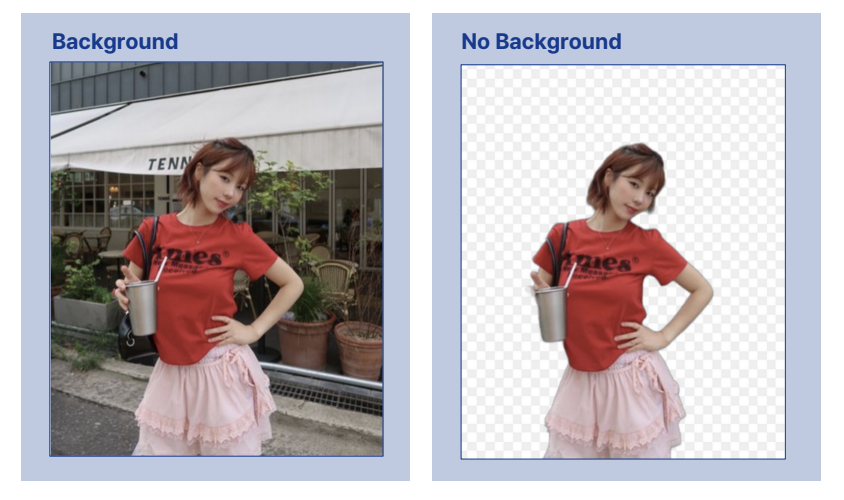
</div>

* **Pre-processing**: Integrated `rembg` for background removal to focus the model on clothing features, and resized image.
<div align="center">
  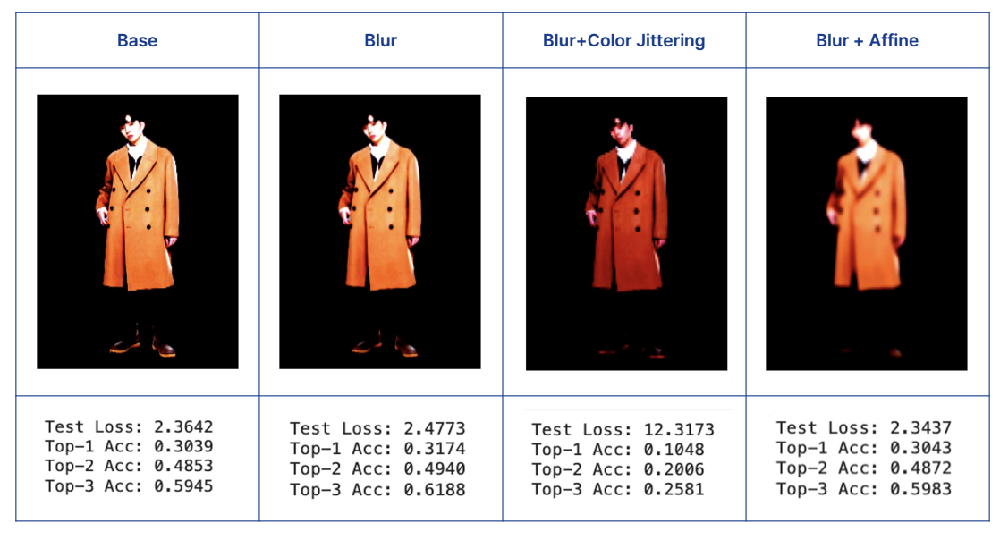
</div>

* **Augmentation**: Applied Gaussian Blurring and Affine transformations to enhance model robustness.

<div align="center">
  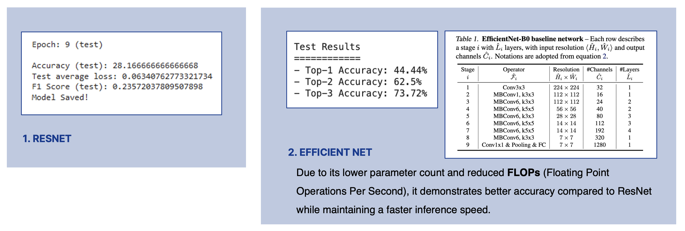
</div>

* **Model Selection**: EfficientNet was chosen for its high efficiency and superior accuracy (Top-3 Acc: 73.72%) compared to ResNet. 

## 📍 Similarity Analysis
### Model Selection 
<div align="center">
  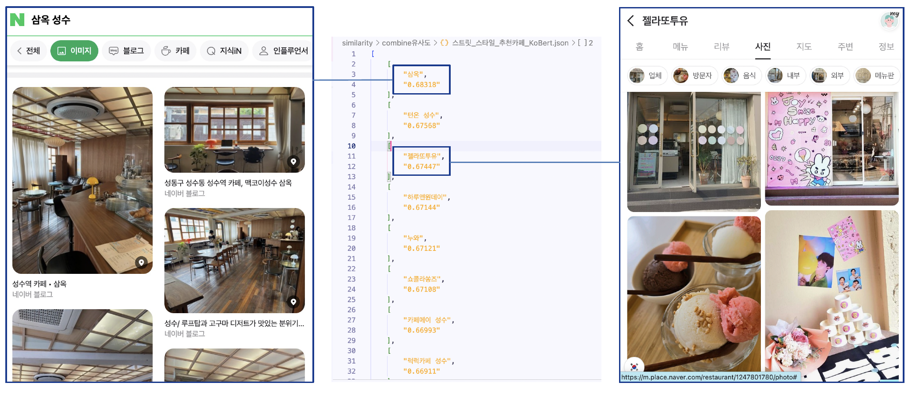
</div>

1. **KoBERT**
  * **Method**: Combined Jaccard and Cosine similarity.
  * **Evaluation**: While overall performance was not bad, it showed limitations in specific categories like "Street" style.
  * **Conclusion**: Decided to explore alternative methods to improve accuracy.
  
<div align="center">
  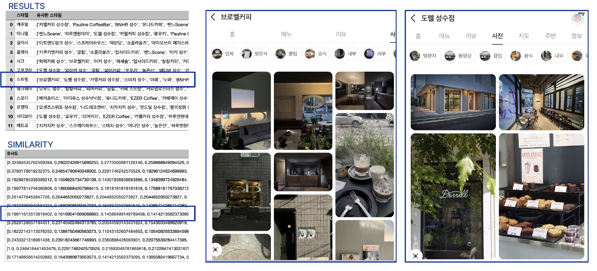
</div>

2. **CountVectorizer**
* **Approach**: Switched to CountVectorizer since the analysis involves comparing sets of keywords.
* **Logic**: Because duplicate cafe keywords were already handled during pre-processing, CountVectorizer proved to be more suitable as it prioritizes the importance of word frequency.
* **Result**: Achieved more appropriate and reliable results for style-to-cafe matching.


## 📍 Improvements
We improved recommendation quality with a **weighted scoring** approach that reflects the user’s **mixed** style profile.

1) **User weights (CNN)**: The outfit photo is classified into multiple styles with probabilities (e.g., Chic 0.7, Gorpcore 0.3).  
2) **Cafe similarity (precomputed)**: Each cafe has precomputed similarity scores for each style based on review keywords.  
3) **Final score**: For every cafe, we compute a single score by multiplying and summing across styles, then rank cafes by this score.

**Scoring Formula**:
  $$Score_{i}=\sum_{j}(Weight_{j} \times Similarity_{i,j})$$
  > The algorithm multiplies the probability of each style from the CNN output ($Weight_{outfit}$) by the pre-calculated similarity score of each cafe ($Similarity_{cafe}$) to generate a ranked list of recommendations. 


```python
def calculate_score(cafe_style_sims, outfit_weights):
    """
    cafe_style_sims: list of (style_keyword, similarity) for one cafe
    outfit_weights:  dict {style_keyword: weight} from CNN output
    """
    score = 0.0
    for style, w in outfit_weights.items():
        for cafe_style, sim in cafe_style_sims:
            if cafe_style == style:
                score += w * sim
    return score

# Tie-breaker: if scores are tied, prioritize cafes with higher similarity in the user's primary (highest weight) style.
primary_style = max(outfit_weights, key=outfit_weights.get)

# top_cafes: list of (cafe_id, score) sorted by score desc
i = 0
final_recommendations = []
while i < len(top_cafes):
    group = [top_cafes[i]]
    while i + 1 < len(top_cafes) and top_cafes[i][1] == top_cafes[i + 1][1]:
        group.append(top_cafes[i + 1])
        i += 1

    if len(group) > 1:
        group.sort(key=lambda x: cafe_avg_data[x[0]].get(primary_style, 0.0), reverse=True)

    final_recommendations.extend(group)
    i += 1
  ```


## 📍 Team DripShot (YBIGTA 25th)
* **Authors**: Minseo Kim (DA, Team Leader), Dogeun Im (DA), Jiyeon Seo (DA), Isaac Chung (DE), Jaebin Cheong (DS)
* **Project Date**: 2024.08


## 📍 Version History
**1)   0.1**
- **Initial Release**
  - Location: 성수역 / Seongsu Station Only

## 📍 Acknowledgments
Background removal via rembg
* https://github.com/danielgatis/rembg
